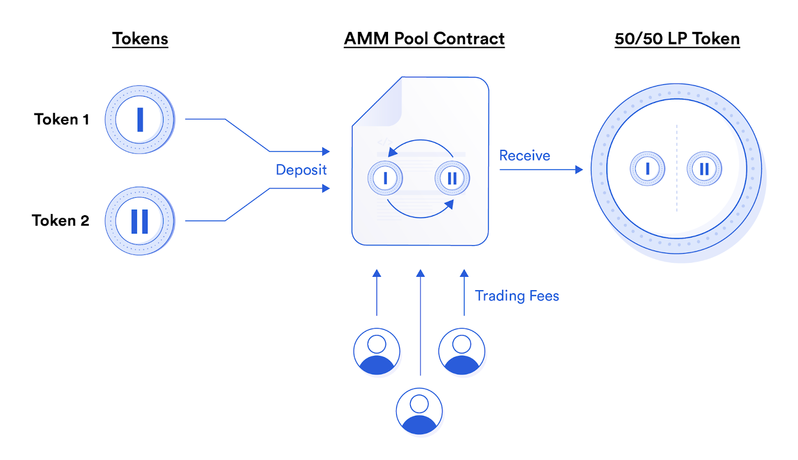

# Single Sided Liquidity

### <em>What is Single-Sided Liquidity?</em>

`Single-Sided Liquidity` refers to non-paired liquidity provisioning. Usual liquidity pools powered by AMMs require a liquidity provider to deposit an equal stake of a pair of tokens (`Double-Sided Liquidity`), while `Single-Sided Pools` just require the target token to be deposited, granting LP fees that are paid in that same token.

### <em>How does Single-Sided Liquidity work?</em>

By depositing a single token and not a bound pair, there is no balance ratio of the LPs tokens to adjust according to takers' behaviour and as such `Impermanent Loss` is mitigated and only dependent on the assets' inherent price fluctuations. 

<figure markdown>
  {: .center style="height:460px; width:800px;"}
  <figcaption>Conventional double-sided LP</figcaption>
</figure>

 
 
 